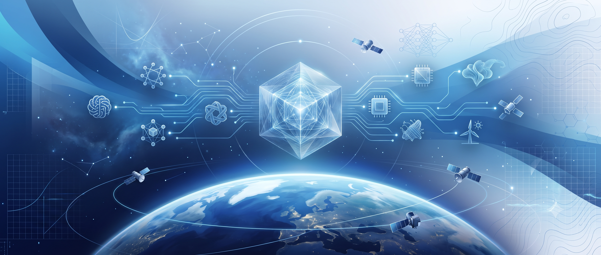
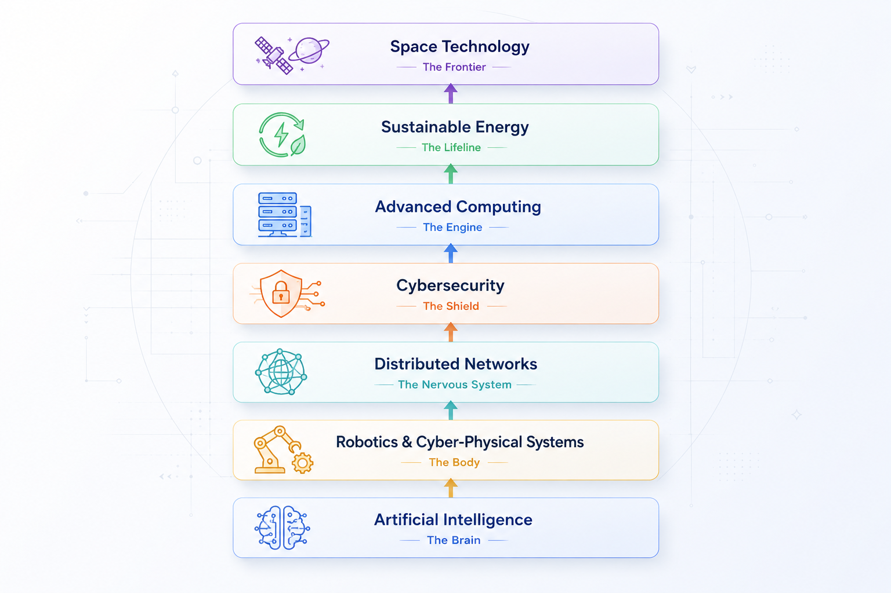

<!--
================================================================================
                            GITHUB PROFILE README
================================================================================

Project          : Personal GitHub Portfolio
Owner            : Bikram Karmakar
Version          : vNext
Status           : Under Construction

This README is intentionally written as a complete design system rather than
a simple profile page.

Every section is modular.

Future images will replace placeholders.

Do NOT remove comments unless necessary.

================================================================================
-->

<!-- ====================================================================== -->
<!-- HERO BANNER                                                            -->
<!-- assets/hero-banner.webp                                                -->
<!-- Size : 1600 × 500                                                      -->
<!-- ====================================================================== -->

    

 

# Bikram Karmakar

### Architecting Civilization-Scale Autonomous Infrastructure

 

*"Engineering resilient intelligent systems that connect Artificial Intelligence,
Cyber-Physical Systems, Robotics, Distributed Networks, Secure Computing,
Sustainable Energy, and Space Technology into one unified ecosystem."*

 

<!-- Typing SVG -->

 

<!-- Social Icons -->

-------------------------------------------------------------------------------------------------------------------------------------------------------
<!-- ====================================================================== -->
<!-- MISSION                                                                -->
<!-- ====================================================================== -->

# MISSION

<!-- ====================================================================== -->
<!-- PROFILE PHOTO                                                          -->
<!-- assets/Profile-Photo.jpg                                               -->
<!-- ====================================================================== -->

    

 

Artificial Intelligence is the intelligence. Robotics and embedded cyber-physical
systems are the physical embodiment. Distributed networks form the nervous
system that connects them, while cybersecurity and cryptography establish trust
and resilience. Advanced computing provides the computational power,
sustainable energy enables continuous operation, and space serves as the
ultimate proving ground.

My vision is to integrate these disciplines into self-improving autonomous
infrastructure capable of coordinating, protecting, and optimizing critical
systems at planetary—and eventually interplanetary—scale.

My long-term mission is to architect technologies that advance civilization
through resilient, trustworthy, and scalable intelligence. In the near term, I
focus on solving meaningful real-world problems that strengthen the knowledge,
experience, and engineering foundation required to realize that vision.

Because autonomous infrastructure must ultimately serve civilization, my
technical work is informed by the broader systems that shape our world—from
neuroscience and cognitive psychology to geopolitics, institutional economics,
and complex adaptive systems. I believe the most transformative breakthroughs
emerge at the intersection of disciplines, where engineering is guided by a
deeper understanding of intelligence, strategy, human behavior, and rational
decision-making.

Beyond engineering, I continuously cultivate these perspectives through
analytical literature, speculative science fiction, chess, sketching, music,
and strategic sports—not simply as hobbies, but as complementary ways of
studying patterns, creativity, and the complex interactions that shape reality.

------------------------------------------------------------------------------------------------------------------------------------------------------
<!-- ======================= AVAILABLE FOR WORK ======================= -->

# 💼 Available for Internships & PPO

I am currently **open to internships, pre-placement offers (PPOs), research collaborations, and exciting opportunities** in **Artificial Intelligence, Software Engineering, Robotics, Embedded Systems, Cybersecurity, and Full-Stack Development.**

 

<!-- ================================================================ -->

<!-- ====================================================================== -->
<!-- FOOTER                                                                 -->
<!-- ====================================================================== -->

 

<!-- ====================================================================== -->
<!-- ENGINEERING ECOSYSTEM                                                     -->
<!-- ====================================================================== -->

# ENGINEERING ECOSYSTEM

<!-- ====================================================================== -->
<!-- IMAGE                                                                  -->
<!-- assets/Civilization-Stack.png                                          -->
<!-- ====================================================================== -->

    

 

The technologies I pursue are not isolated domains, but interconnected layers
of a single engineering ecosystem. Each layer builds upon the foundation below
while enabling the capabilities above.

Together, they represent my long-term vision of designing resilient,
trustworthy, and self-improving autonomous infrastructure capable of solving
complex real-world challenges at planetary—and eventually interplanetary—scale.

----------------------------------------------------------------------------------------------------------------------------------------------------
<!-- ====================================================================== -->
<!-- TECHNICAL SKILLS                                                       -->
<!-- ====================================================================== -->

# TECHNICAL SKILLS

<table width="100%">
<tr>
<td width="270"><strong>💻 Programming Languages:</strong></td>
<td>

</td>
</tr>

<tr>
<td width="270"><strong>🌐 Web Technologies:</strong></td>
<td>

</td>
</tr>

<tr>
<td width="270"><strong>🧠 Artificial Intelligence:</strong></td>
<td>

</td>
</tr>

<tr>
<td width="270"><strong>⚙️ Core Computer Science:</strong></td>
<td>

</td>
</tr>

<tr>
<td width="270"><strong>🛠️ Developer Tools:</strong></td>
<td>

</td>
</tr>
</table>

---

    

<!-- ======================= GITHUB STATS ======================= -->

  

<!-- =========================================================== -->
------------------------------------------------------------------------------------------------------------------------------------------------------

<b>
Made with ❤️
</b>

<!--

================================================================================

END OF README

Future Asset Checklist

□ Hero Banner

□ Mission Illustration

□ Architecture Diagram

□ Knowledge Constellation

□ Technology Stack SVG

□ Projects Cards

□ Roadmap Timeline

□ Dashboard Illustration

□ GitHub Stats Layout

□ Certifications

□ Publications

□ Blog

□ Contact Banner

□ Footer Illustration

================================================================================

README Version

Design System v1

Status

Structure Complete

Next Stage

Visual Design

Image Generation

SVG Design

Component Refinement

Spacing Optimization

Typography Improvements

GitHub Widget Integration

================================================================================

-->
